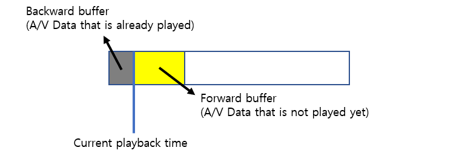
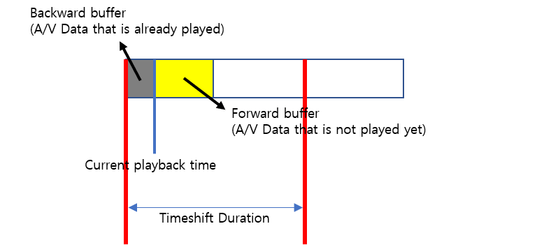
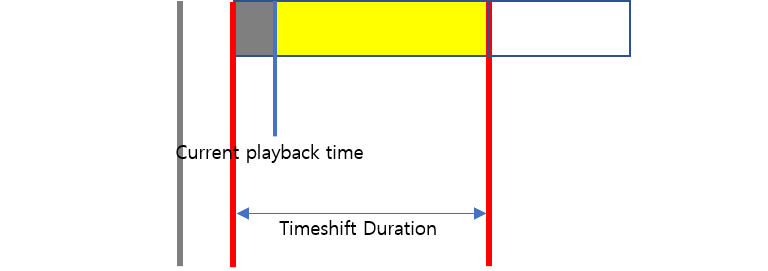

# Client Time Shift

Time shifting is a feature to store real-time data as it is received so that the user can watch past data while playing live content. The user can seek freely within the stored buffer. When the user seeks to a certain time, the a/v data before the seek time will be deleted gradually.

### How to activate and execute Client Time Shift

To activate Client Time Shift, set the properties below. Then the player will continue to download the file even if it is paused. If the player fills the buffer with uiTimeShiftDuration minutes, or if the buffer is full, then the playback will resume automatically. To go to live position, call *player.go(toCurrentLivePosition: )* API.

The code for the client time shift classes is provided by **NexClientTimeShiftController.h**

* Example 1: Activate Client Time Shift

```swift
let params: NexClientTimeShiftParams
params.fileBufferPath = nil         // Stored content path
params.timeshiftBufferSize = 400    // Max buffer size (MB)
params.timeshiftDuration = 10       // Max buffer duration (Minutes)
        
let clientController: NexClientTimeShiftController = 
    NexClientTimeShiftController.init(nexPlayer: nexPlayer, param: params)
clientController.enable()
clientController.disable()
```

* Example 2: Execute Client Time Shift by pausing the player (The download will continue)

```swift
nexPlayer.pause()
```

* Example 3: Go to live position

```swift
nexPlayer.go(toCurrentLivePosition: true)
```

### Detailed description of how Client Time Shift works

* Backward buffer and forward buffer 



Backward buffer and forward buffer

* Timeshift Duration includes the backward buffer as well. 



Timeshift Duration includes the backward buffer

* When pause() is called, the player fills the buffer until it has filled in the buffer for a Timeshift Duration. When the buffer is filled with Timeshift Duration, the player resumes playback. If the user tries to pause immediately after playback is resumed, the player will immediately restart because it has a buffer filled in Timeshift Duration.



Fill the buffer until it reaches to the Timeshift Duration

* As the playback time elapses, the buffer behind the playback time is deleted and new data is buffered. Therefore, the total amount of the buffered data is approximately equal to the Timeshift Duration. If the user tries to pause at this point, the player may immediately resume because the buffer is already filled with TimeshiftDuration.


Go to play time

* If the user seeks forward, the buffer after the play time is deleted except the backward duration. 


Seek to forward

* Then, the user can pause again. If pause is called, the player will fill the buffer up to Timeshift Duration. 


Pause again