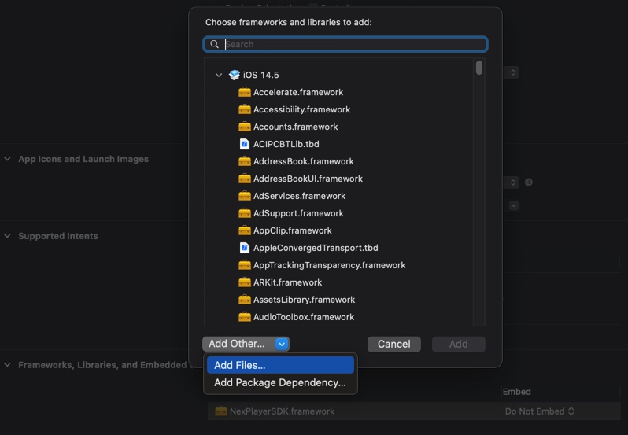
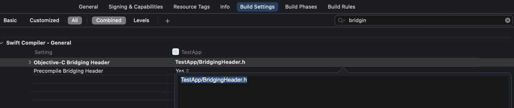

# Setup Guide

Through this guide you will be introduced to the basic steps for setting up the playback with NexPlayer iOS SDK.

First thing you have to keep in mind before implementing NexPlayer SDK is that most of player methods behave __asynchronously__. There are numerous methods available in `NexPlayerDelegate.h` which listen to what is happening in NexPlayer. Asynchronous approach is strongly recommended in NexPlayer SDK.

## Importing SDK

You will need to follow a couple of steps in order to get NexPlayerSDK up and running.

From the NexPlayer iOS SDK package get the NexPlayerSDK.framework and include it into your project.  To do so; go to your project settings > General > Frameworks, Libraries and Embedded Content. Click on the Add(+) button > Add Other > Add Files.

Now you can search for the location of the *NexPlayerSDK.framework* and select it. Make sure it is on embed mode: *Do not Embed*.  



You will also need to add some other frameworks, listed below, in order for the NexPlayerSDK to work properly:  

* AudioToolbox.framework
* OpenGLES.framework
* Foundation.framework
* AVFoundation.framework
* QuartzCore.framework
* SystemConfiguration.framework
* CoreVideo.framework
* CoreMedia.framework
* VideoToolbox.framework

You are almost done, go to your project and create a new **header** file. Name it as you like and import the necessary SDK headers:

```objc
#ifndef BridgingHeader_h
#define BridgingHeader_h

#import <NexPlayerSDK/NexPlayerSDK.h>
#import <NexPlayerSDK/NXPlayer.h>
#import <NexPlayerSDK/NXPlayerDelegate.h>
#import <NexPlayerSDK/NXContentInfo.h>

#endif
```

Finally, you need to reference this header file into your project. Go to your Project Settings > Build Settings > Search for *Objective-C Bridging Header* and point to the header file you just created.



Now you have the project already setup to use NexPlayer iOS SDK.

## Integrating NexPlayerView

`NexPlayerView` is the recommended and easiest way to render a video with *NexPlayer*. It includes a `NXPlayer` instance for controlling the playback within the view.

For a quick start to your first application, create a `UIViewController` subclass that implements the `NXPlayerDelegate` protocol. In this example the class will be called 'PlayerController'.

```swift
class PlayerController: UIViewController, NXPlayerDelegate {
    override func viewDidLoad() {
    	...
    }
}
```

Now add the following code in the `viewDidLoad` method.

```swift
override func viewDidLoad() {
	super.viewDidLoad()
	        
	let playerView = NXPlayerView()
	playerView.autoScaling = .fitInView
	playerView.captionRenderController.captionHidden = true
	playerView.autoresizingMask = [.flexibleWidth, .flexibleHeight]
	
	self.view.addSubview(playerView)
	playerView.player.delegate = self
	playerView.player.open("https://your.media.com/index.m3u8")
}
```

?> Update your info.plist file if your content is served over HTTP instead of HTTPS

```xml
<key>NSAppTransportSecurity</key>
<dict>
    <key>NSAllowsArbitraryLoads</key>
    <true/>
</dict>
```

Finally just create an instance of your 'PlayerController' when your app starts, and add its view to your window.

## Listening to the Player Events

NexPlayer generates various events to notify the application of changes in the player’s status in real time. This allows the application to update the user interface in an appropriate manner, detect the end of the content, and respond to errors. All methods are optional, you should implement the methods for events which you wish to handle.

In the *PlayerController* class you have created, you can implement the optional delegate methods to listen those events. 

With the below implementation of NXPlayerDelegate we are making the player to start automatically, with `nxplayer.start()`, once open is done with `completedAsyncCmdOpenWithResult`. Also if any errors happen, we print them for tracking:

```swift
class PlayerController: UIViewController, NXPlayerDelegate {
	
	// On error
	func nexPlayer(_ nxplayer: NXPlayer!, encounteredError errorCode: NXError) {
       guard errorCode != .none else { return }
		print("Error \(errorCode)")
    }

	
	// On open completed
	func nexPlayer(_ nxplayer: NXPlayer!, completedAsyncCmdOpenWithResult result: NXError, playbackType Type: NXPlaybackType) {
        if (result == NXError.none) {
            nxplayer.start()
        } else {
            print("Failed to open video")
        }
    }
}
```

## Controlling the Playback

Playback is controlled through the NexPlayer class, which handles acquisition and decoding of the media data.

The application creates an instance of this class and issues commands to it by calling instance methods. NexPlayer carries out these commands asynchronously and notifies the application of changes in status.

```swift
let playerView = NXPlayerView()
playerView.autoScaling = .fitInView
playerView.player.delegate = self
```

Once we have the initial creation of the player we can start handling the media source using the methods provided by NexPlayer. Certain calls, such as *open* and *close* must be given in matched pairs. The basic structure of calls for media playback is as follow:

* NXPlayer.open()
	* NXPlayer.start()
		* NXPlayer.pause()
		* NXPlayer.seek()
		* NXPlayer.resume()
	* NXPlayer.stop()
* NXPlayer.close()

#### Open command

This method initializes the media at the specified path or URL. The url passed as parameter might be a path (for local content) or URL (for remote content).

`nexPlayer.open(url: String)`

This is an asynchronous operation that completes in the background.  When it is finished, the `NXPlayerDelegate::nexPlayer:completedAsyncCmdOpenWithResult:playbackType:` method of the delegate will be called.

#### Start command

We can call the start method in 3 different ways.

* `nexPlayer.start()` will start content from the beggining
* `nexPlayer.start(fromTime: UInt)` will begin playback of the content from the specified time (miliseconds)
* `nexPlayer.start(fromTime: UInt, pauseAfterReady: Bool)` this start method will begin the playback of the content from the specified time and will play automatically when ready depending on the parameter.

This is an asynchronous operation that completes in the background. When it is finished, the `NXPlayerDelegate::nexPlayer:completedAsyncCmdStartWithResult:playbackType:` method of the delegate will be called.

#### Pause command

Pauses playback of content. Content must be in a playing state or this has no effect. 

```swift
nexPlayer.pause()
```

Playback can be resume by calling `nexPlayer.resume()`.

This is an asynchronous operation that completes in the background. When it is finished, the `NXPlayerDelegate::nexPlayer:completedAsyncCmdPauseWithResult:` method of the delegate will be called.

#### Resume command	

This method resumes playback beginning at the point at which the player was last paused.

```swift
nexPlayer.resume()
```

This is an asynchronous operation that completes in the background. When it is finished, the `NXPlayerDelegate::nexPlayer:completedAsyncCmdResumeWithResult:` method of the delegate will be called.

#### Seek command

Seeks to the specified time (miliseconds) in the content. If the content is currently playing, it will continue playing after the seek; if it is paused, it will be paused after the seek operation.

```swift
nexPlayer.seek(to: UInt)
```

This is an asynchronous operation that completes in the background. When it is finished, the `NXPlayerDelegate::nexPlayer:completedAsyncCmdSeekWithResult:` method of the delegate will be called.

#### Stop command

This function stops the current playback. If the content is currently playing or paused, the content will be stopped first before it is closed.

```swift
nexPlayer.stop()
```

This is an asynchronous operation that completes in the background. When it is finished, the `NXPlayerDelegate::nexPlayer:completedAsyncCmdStopWithResult:` method of the delegate will be called

#### Close command

Close any currently open content. Note that in some cases (such as when this is called while content is already playing, or if an open method is called while there is already open content) the content we automatically be closed when the `NXPlayerDelegate::nexPlayer:completedAsyncCmdStopWithResult:` even occurs. 

```swift
nexPlayer.close()
```

### Handling the player states

NexPlayer handles state-changing API functions asynchronously. The player’s state will not be changed immediately even if the API is called. Therefore, UI applications should check the player’s state using **nexplayer.state**, which indicates the actual state of the player, before calling the API. After calling any state-changing API function, UI applications must wait for the `completedAsyncCmdStopWithResult` message from the player before calling any further state-changing API functions.

NexPlayer has five possible states:

- `NXPlayerState.none`
- `NXPlayerState.close`
- `NXPlayerState.stop`
- `NXPlayerState.play`
- `NXPlayerState.pause`


- Requests for NexPlayer to open, seek, pause, stop and resume are placed in a queue and handled in the order they are received.
- When a queued operation completes, NexPlayer will notify the application by calling the **completedAsyncCmdStopWithResult** method in the listener.
- Some of the requests can take significant time to complete (depending on various factors, for example, network conditions). Therefore, the recommended practice is for the application to issue only one request at a time and wait for that request to complete.

#### Seek Sequence Example

In order to provide the best user experience, after calling seek command, the application should wait for `completedAsyncCmdSeekWithResult` callback before calling `seek()` again. In the meantime, if the user continues to request seek operations (such as by dragging a seek bar in the user interface), the application should remember only the most recent seek request and issue that request after receiving `completedAsyncCmdSeekWithResult`.

**Seek Function**

```swift
if (mBoolSeekStarted) {
	mSeekToTime = position
}
else {
	mBoolSeekStarted = true
	let iRet = nexPlayer.seek(to: position)

	if(iRet != NXError.none) {
		mBoolSeekStarted = false
	}
}
```

**Delegate completedAsyncCmdSeekWithResult Function**
	
```swift
func nexPlayer(_ nxplayer: NXPlayer!, completedAsyncCmdSeekWithResult result: NXError) {
	if (mBoolSeekStarted) {
		let iRet = nexPlayer.seek(to: mSeekToTime)
		if(iRet != NXError.none) {
			mSeekToTime = 0
			mBoolSeekStarted = false
		}
	}
	else {
		mBoolSeekStarted = false
	}
}
```


## Properties

It is possible to set certain properties on the NexPlayer instance, which affect how media is played back, how audio/video synchronization is handled, which player features are enabled, and so on. In general, the default property settings are suitable for most applications. However, in some cases, you may want to adjust certain properties.

#### Log Level
The logging level for the NexPlayer protocol module. This affects the type of messages that are logged by the protocol module.  
The possible values for the Log Level are:  

- `NXPropertyLogLevel_Frame`
- `NXPropertyLogLevel_Debug`  
- `NXPropertyLogLevel_RTP`  
- `NXPropertyLogLevel_RTCP`  

```swift
nexPlayer.setProperty(NXPropertyLogLevel, value: NXPropertyLogLevel_Debug as NSObject)
```